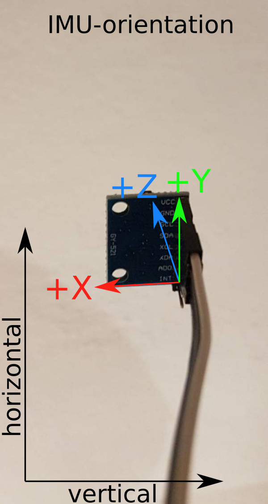

# MagicWand-TFLite-ESP32-MPU6050

This Project contains all necessary code and scripts to train a gesture recognition model ([TensorFlow Lite](https://tensorflow.org/lite/microcontrollers/overview)) usable with an ESP32 and a MPU6050 IMU.

## Setup

### Arduino IDE

For installation instructions see <https://www.arduino.cc/en/software>.

#### ESP32 Support

Setup the Arduino IDE to support ESP32 microcontrollers following the instructions on the espressif documentation page: <https://docs.espressif.com/projects/arduino-esp32/en/latest/installing.html>. The version used in this project was 2.0.2

#### MPU6050 Support

Install the Adafruit MPU6050 library for the IMU using the Library Manager of the Arduino IDE. Instructions on how to install libraries for the Arduino IDE can be found at <https://docs.arduino.cc/software/ide-v1/tutorials/installing-libraries> and the library is available on github at <https://github.com/adafruit/Adafruit_MPU6050>. In the Library Manager it is called **Adafruit MPU6050** and the project was tested with version 2.0.5. 

#### TensorFlowLite for ESP32

Install the TensorFloorLite package for the ESP32 using the Arduino IDE Library Manager. The package is called **TensorFLowLite_ESP32** and can be found on github at <https://github.com/tanakamasayuki/Arduino_TensorFlowLite_ESP32>. The project was tested with version 0.9.0.

## magic_wand_esp32_mpu6050

Basic magic wand example code taken from the Arduino library TensorFLowLite_ESP32 (<https://github.com/tanakamasayuki/Arduino_TensorFlowLite_ESP32>) and modified to work with the MPU6050. Further, adaption were made to work with the CNN model of the training script (see train directory).

### Changes

#### magic_wand_esp32_mpu6050.ino

The `tflite::ops::micro::AllOpseResolver` was used to support the CNN model from the training script (instead of the `tflite::MicroMutableOpResolver`).

#### accelerometer_handler.cpp

Implementation of setup and reading of accelerometer data from MPU6050 IMU.

#### magic_wand_model_data.cpp

Model changed to CNN model trained with training script and example data.

## train

Basic training code taken from tflite-micro project (<https://github.com/tensorflow/tflite-micro>) and modified to work with own captured training data. For more details and instructions see [README.md](https://github.com/stefan-spiss/MagicWand-TFLite-ESP32-MPU6050/tree/main/train#readme) in train folder.

### Changes

#### README.md

Adpated slightly to show how to train a model with the data available in this repository.

#### data_prepare.py

Updated the loading of training data to work with the example data provided in this repository (see data folder).

#### train_magic_wand_model.ipynb

Updated goolge colab notebook to use data from this repository to train the gesture detection model.

## gesture_capture

Arduino script to capture training data with an ESP32 and a MPU6050. Open the gesture_capture.ino file in the Arduino IDE, compile and upload it to the ESP32 and open the Serial Monitor. Sending `o` to the ESP32 starts the capturing of acceleration data and the accelerometer readings will be plotted on the serial monitor. To stop the capture send a `p` to the ESP32. The data block for one gesture always should start with `-.-.-` and end with at least one blank line.

To caqpture gestures, clear the serial monitor in the beginning, then start the capturing, perform the gesture and stop the capturing. After that, repeat the capturing for the same gesture as often as you like. In the end, the whole output of the Serial Monitor can be copied and saved to a file named `output_<gesture>_<name>.txt` (replace `<gesture>` with the gesture name and `<name>` with the persons name that generated the data). Further, for each gesture the files should be in its own folder (see the data folder for an example).

## data

Example dataset containing gesture captures for a wing (**W**), a ring (**O**) and a slope (**L**) gesture performed by one person. There is also **negative** data that contains captures obtained while no gestures were performed. If not (too little) provided, random generated samples will be used instead (in addition). 

To allow the usage of the example data set and the pre-trained model, the following image shows the orientation of the IMU used while capturing the gestures.

    

